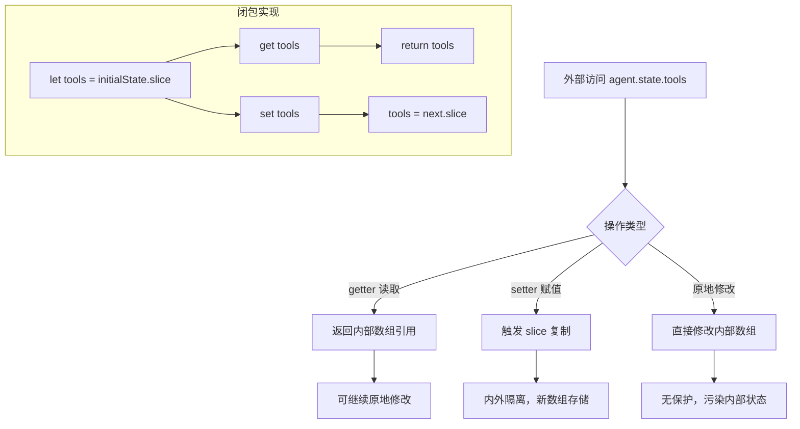
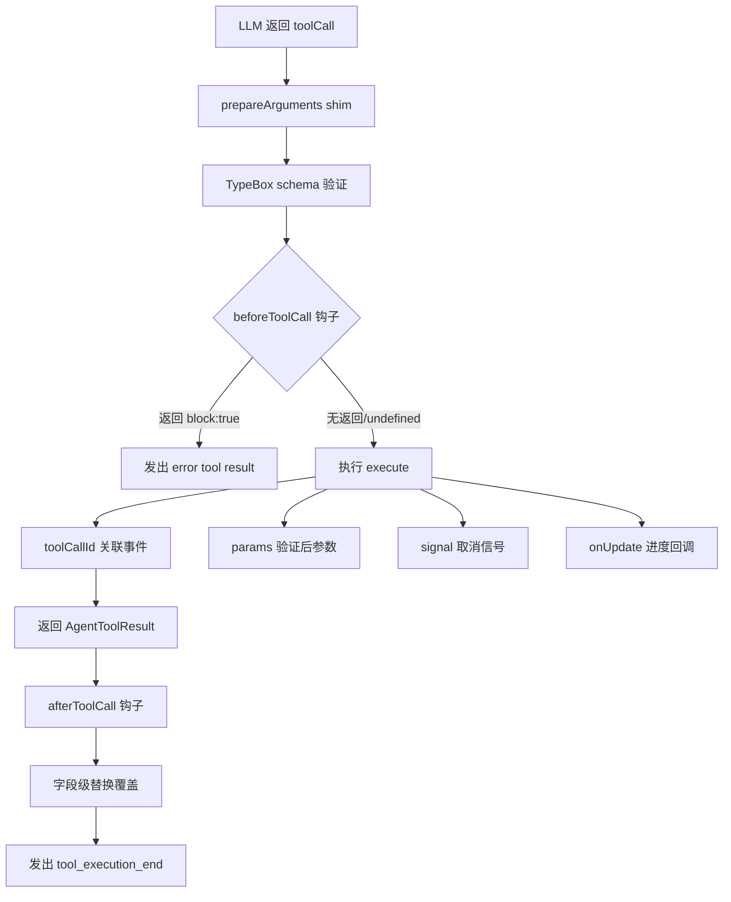
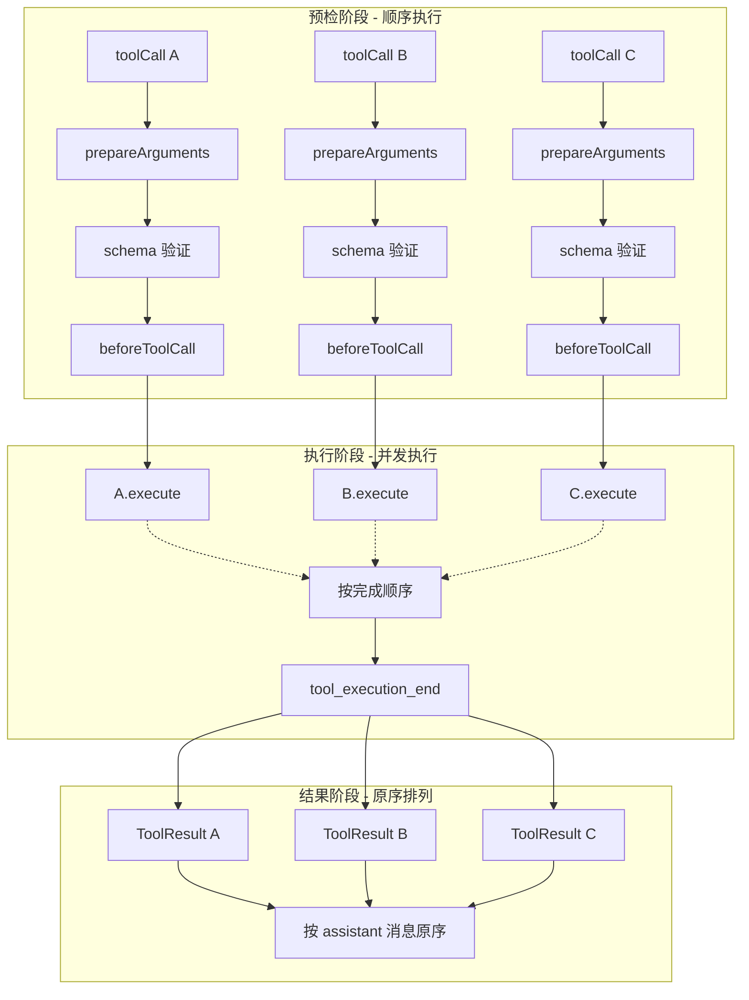
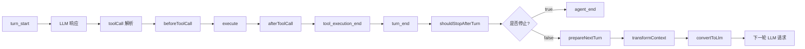

# L02 Flowchart: 类型关系流程

## AgentState 访问流程

```mermaid
flowchart TD
    A[外部访问 agent.state.tools] --> B{操作类型}
    
    B -->|getter 读取| C[返回内部数组引用]
    B -->|setter 赋值| D[触发 slice 复制]
    B -->|原地修改| E[直接修改内部数组]
    
    C --> F[可继续原地修改]
    D --> G[内外隔离，新数组存储]
    E --> H[无保护，污染内部状态]
    
    subgraph 闭包实现
        I[let tools = initialState.slice] --> J[get tools]
        J --> K[return tools]
        I --> L[set tools]
        L --> M[tools = next.slice]
    end
```

## AgentTool 执行流程

```mermaid
flowchart TD
    A[LLM 返回 toolCall] --> B[prepareArguments shim]
    B --> C[TypeBox schema 验证]
    C --> D{beforeToolCall 钩子}
    
    D -->|返回 block:true| E[发出 error tool result]
    D -->|无返回/undefined| F[执行 execute]
    
    F --> G[toolCallId 关联事件]
    F --> H[params 验证后参数]
    F --> I[signal 取消信号]
    F --> J[onUpdate 进度回调]
    
    G --> K[返回 AgentToolResult]
    K --> L[afterToolCall 钩子]
    L --> M[字段级替换覆盖]
    M --> N[发出 tool_execution_end]
```

## parallel 执行模式详解

```mermaid
flowchart TD
    subgraph 预检阶段[预检阶段 - 顺序执行]
        A1[toolCall A] --> B1[prepareArguments]
        B1 --> C1[schema 验证]
        C1 --> D1[beforeToolCall]
        
        A2[toolCall B] --> B2[prepareArguments]
        B2 --> C2[schema 验证]
        C2 --> D2[beforeToolCall]
        
        A3[toolCall C] --> B3[prepareArguments]
        B3 --> C3[schema 验证]
        C3 --> D3[beforeToolCall]
    end
    
    subgraph 执行阶段[执行阶段 - 并发执行]
        D1 --> E1[A.execute]
        D2 --> E2[B.execute]
        D3 --> E3[C.execute]
        
        E1 -.-> F1[按完成顺序]
        E2 -.-> F1
        E3 -.-> F1
        
        F1 --> G[tool_execution_end]
    end
    
    subgraph 结果阶段[结果阶段 - 原序排列]
        G --> H1[ToolResult A]
        G --> H2[ToolResult B]
        G --> H3[ToolResult C]
        
        H1 --> I[按 assistant 消息原序]
        H2 --> I
        H3 --> I
    end
```

## AgentLoopConfig 钩子时序

```mermaid
flowchart LR
    A[turn_start] --> B[LLM 响应]
    B --> C[toolCall 解析]
    C --> D[beforeToolCall]
    D --> E[execute]
    E --> F[afterToolCall]
    F --> G[tool_execution_end]
    G --> H[turn_end]
    H --> I[shouldStopAfterTurn]
    I --> J{是否停止?}
    
    J -->|true| K[agent_end]
    J -->|false| L[prepareNextTurn]
    L --> M[transformContext]
    M --> N[convertToLlm]
    N --> O[下一轮 LLM 请求]
```