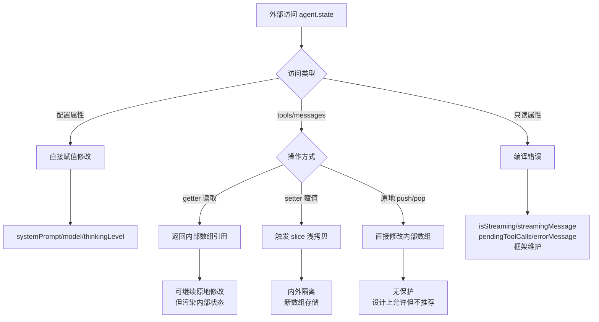
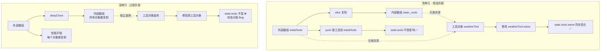
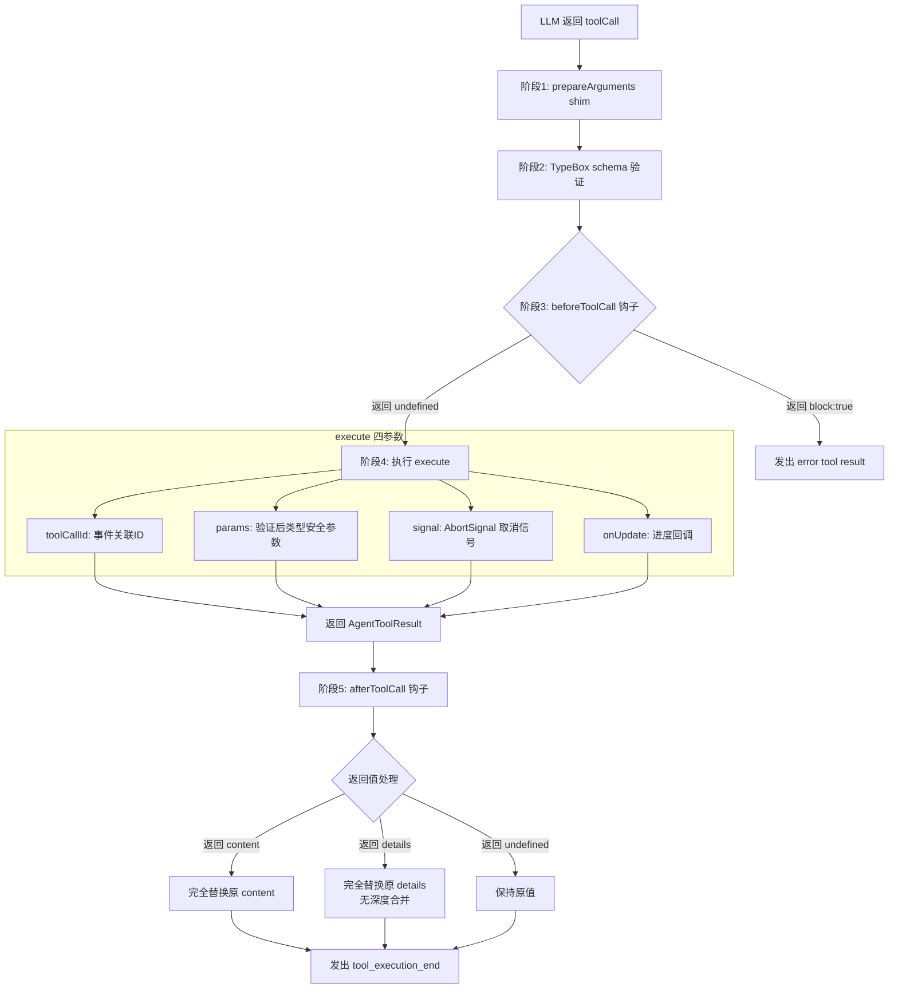
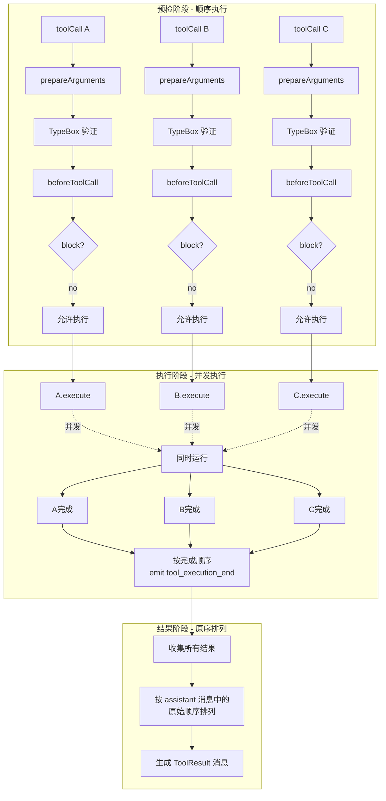
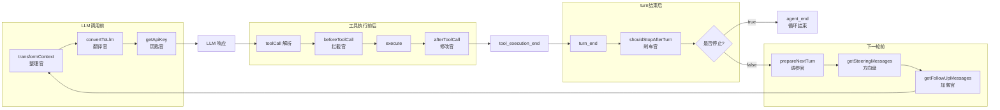

# L02 Flowchart: 类型系统完整流程图

## AgentState 访问流程



## 浅拷贝 vs 深拷贝对比



## AgentTool 执行完整流程



## parallel 执行模式三阶段详解



## AgentLoopConfig 八大钩子时序



## 三者关系图

```mermaid
flowchart TD
    subgraph State[AgentState - 这一刻的"是什么"]
        S1[配置: systemPrompt/model/thinkingLevel]
        S2[对话内容: tools数组/messages数组]
        S3[运行状态: 4个只读属性]
    end
    
    subgraph Tool[AgentTool - 技能卡]
        T1[继承Tool: name/description/parameters]
        T2[新增: label/prepareArguments/execute/executionMode]
    end
    
    subgraph LoopConfig[AgentLoopConfig - 工作流程规则书]
        L1[必需: model/convertToLlm]
        L2[钩子: 8个可选钩子]
        L3[模式: toolExecution/QueueMode]
    end
    
    Tool -->|放在数组中| S2
    LoopConfig -->|创建时传入| Agent[Agent实例]
    State -->|运行时变化| Agent
```