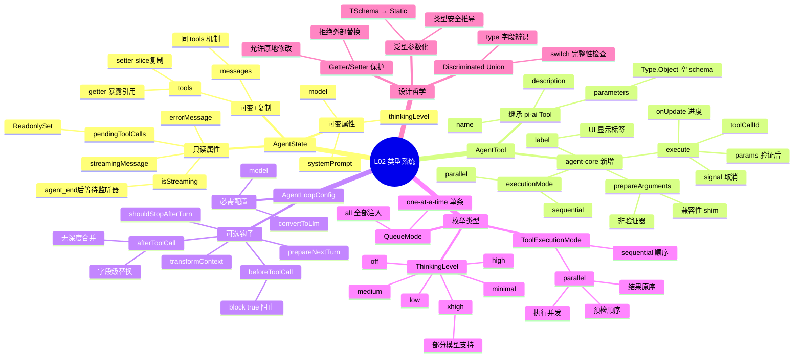

# L02 Mindmap: 类型系统概念层级

```mermaid
mindmap
  root((L02 类型系统))
    
    AgentState
      可变属性
        systemPrompt
        model
        thinkingLevel
      可变+复制
        tools
          getter 暴露引用
          setter slice复制
        messages
          同 tools 机制
      只读属性
        isStreaming
          agent_end后等待监听器
        streamingMessage
        pendingToolCalls
          ReadonlySet
        errorMessage
    
    AgentTool
      继承 pi-ai Tool
        name
        description
        parameters
          Type.Object 空 schema
      agent-core 新增
        label
          UI 显示标签
        prepareArguments
          兼容性 shim
          非验证器
        execute
          toolCallId
          params 验证后
          signal 取消
          onUpdate 进度
        executionMode
          sequential
          parallel
    
    AgentLoopConfig
      必需配置
        model
        convertToLlm
      可选钩子
        beforeToolCall
          block true 阻止
        afterToolCall
          字段级替换
          无深度合并
        shouldStopAfterTurn
        prepareNextTurn
        transformContext
    
    枚举类型
      ToolExecutionMode
        sequential 顺序
        parallel
          预检顺序
          执行并发
          结果原序
      QueueMode
        all 全部注入
        one-at-a-time 单条
      ThinkingLevel
        off
        minimal
        low
        medium
        high
        xhigh
          部分模型支持
    
    设计哲学
      Discriminated Union
        type 字段辨识
        switch 完整性检查
      Getter/Setter 保护
        拒绝外部替换
        允许原地修改
      泛型参数化
        TSchema → Static
        类型安全推导
```