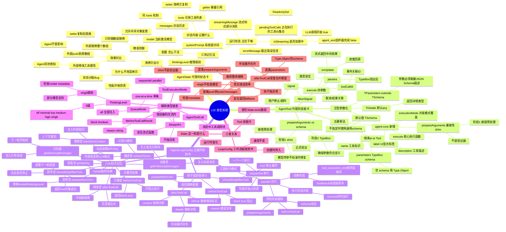

# L02 Mindmap: 类型系统完整概念层级

```mermaid
mindmap
  root((L02 类型系统))
    
    AgentState 代理的状态卡
      三块记忆法
        配置 怎么干活
          systemPrompt 系统提示词
          model 当前激活模型
          thinkingLevel 推理级别
        对话内容 记着什么
          tools 可用工具列表
            getter 暴露引用
            setter 浅拷贝复制
          messages 对话历史
            同 tools 机制
        运行状态 正在干嘛
          isStreaming 是否处理中
            LLM调用开始 true
            agent_end监听器完成 false
          streamingMessage 流式响应部分消息
          pendingToolCalls 正在执行的工具ID集合
            ReadonlySet
          errorMessage 最近错误信息
      
      浅拷贝设计
        精准防御
          只防御数组替换
          允许共享对象变更
        效果对比
          外部修改工具属性
            Agent同步感知
          外部push到原数组
            Agent不受影响
          外部替换整个数组
            setter复制后隔离
        为什么不用深拷贝
          状态分裂Bug
          性能开销昂贵
      
    AgentTool 代理的技能卡
      五要素法
        继承pi-ai Tool
          name 工具标识
          description 工具描述
          parameters TypeBox schema
            空 schema 用 Type.Object
        agent-core 新增
          label UI显示标签
          prepareArguments 兼容性shim
            不是验证器
            阶段1 容错预处理
          execute 核心执行函数
          executionMode 并发模式覆盖
      
      execute 四参数
        toolCallId
          事件关联ID
          取消/结果关联
        params
          TypeBox验证后
          类型安全
        signal
          AbortSignal
          用户停止/超时
        onUpdate
          进度回调
          流式返回中间结果
      
      泛型参数化
        TParameters extends TSchema
          参数必须能被JSON Schema描述
        默认值 TSchema
          不指定时使用通用schema
        TDetails 默认any
          返回详情类型
      
      prepareArguments vs schema
        阶段1 shim
          容错预处理
          模型传参不标准时修复
        阶段2 TypeBox
          正式验证
          确保参数符合定义
    
    AgentLoopConfig 主循环规则书
      八大钩子记忆
        翻译官 convertToLlm
          内部消息转LLM格式
          过滤UI通知
        整理官 transformContext
          上下文裁剪
          注入外部知识
        钥匙官 getApiKey
          动态获取API Key
          OAuth短时令牌
        拦截官 beforeToolCall
          可阻止执行
          返回block true
        修改官 afterToolCall
          可覆写结果
          字段级替换
          无深度合并
        刹车官 shouldStopAfterTurn
          决定是否停止
          返回true优雅退出
        调参官 prepareNextTurn
          调整下一轮配置
          替换model/thinkingLevel
        方向盘 getSteeringMessages
          注入引导消息
          下一轮开始前
        加餐官 getFollowUpMessages
          注入后续消息
          无工具无引导时
      
      钩子返回值语义
        beforeToolCall
          block true 阻止
          reason 错误文本
        afterToolCall
          content 替换内容
          details 替换详情
            手动展开合并
          isError 替换错误标志
        shouldStopAfterTurn
          true 停止循环
        prepareNextTurn
          返回替换配置
      
      工具执行模式
        sequential 串行
          一个一个执行
          写操作独占资源
        parallel 并行
          预检阶段顺序
            prepareArguments
            schema验证
            beforeToolCall
          执行阶段并发
            execute同时运行
          结果阶段
            tool_execution_end按完成顺序
            ToolResult消息按原序
    
    辅助类型速查
      StreamFn
        安全流式函数
        不抛异常
        错误编码在流内
      ToolExecutionMode
        sequential parallel
      QueueMode
        all 全部注入
        one-at-a-time 单条
      AgentToolCall
        消息中工具调用块
      BeforeToolCallResult
        block boolean
        reason string
      ThinkingLevel
        6级
          off minimal low medium high xhigh
        xhigh限制
          部分模型支持
          检查model metadata
    
    三者关系
      State 这一刻是什么
        运行时变化
      Tool 技能卡
        放在State.tools数组
      LoopConfig 工作流程规则书
        创建时传入
        通常不变
    
    常见错误清单
      遗漏parameters
        Type.Object空schema
      混淆prepareArguments
        shim不是验证器
      afterToolCall深度合并期望
        手动展开合并
      xhigh不检查模型
        检查metadata
      直接push到tools/messages
        推荐整体替换
      钩子抛异常
        安全返回fallback
```