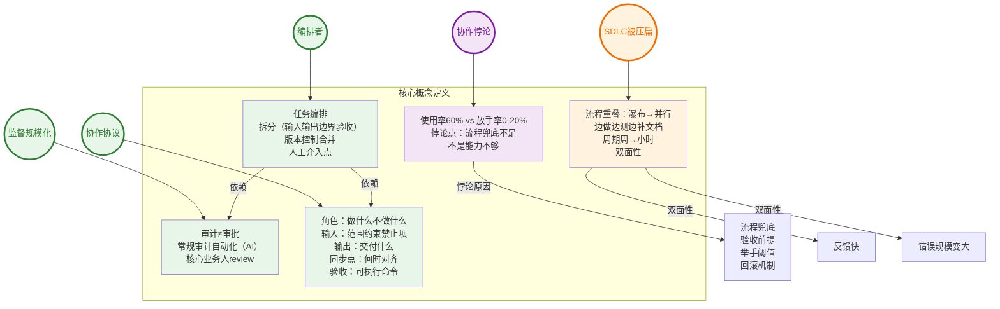
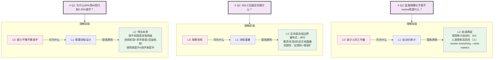
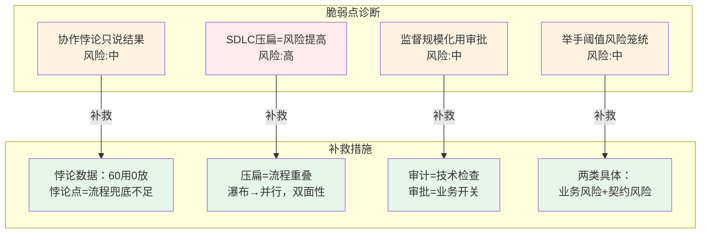
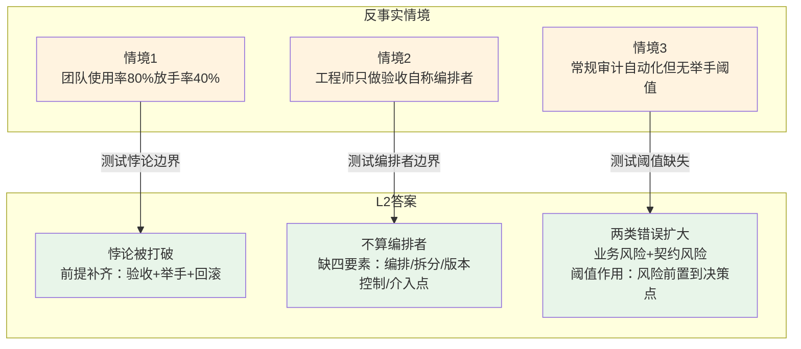
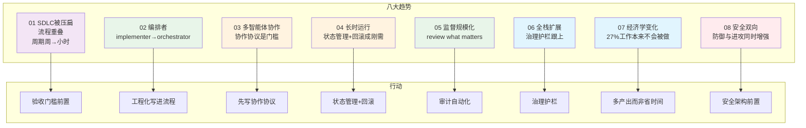
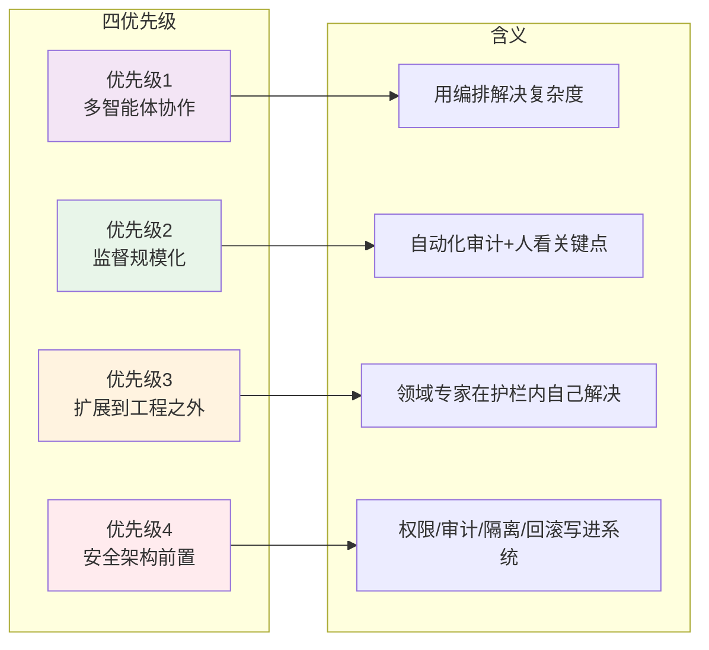
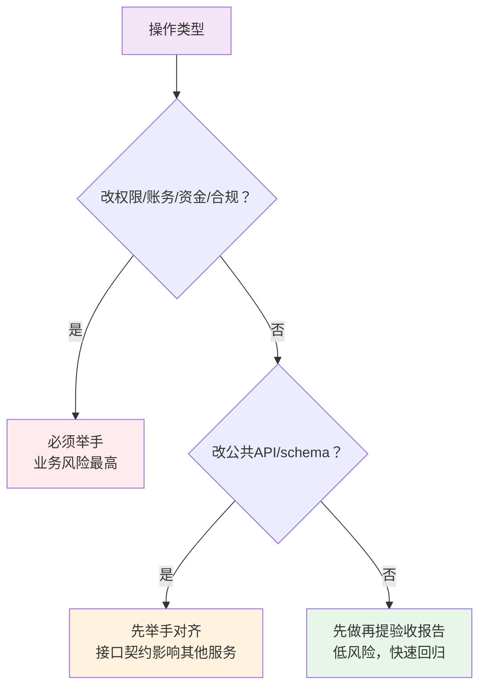
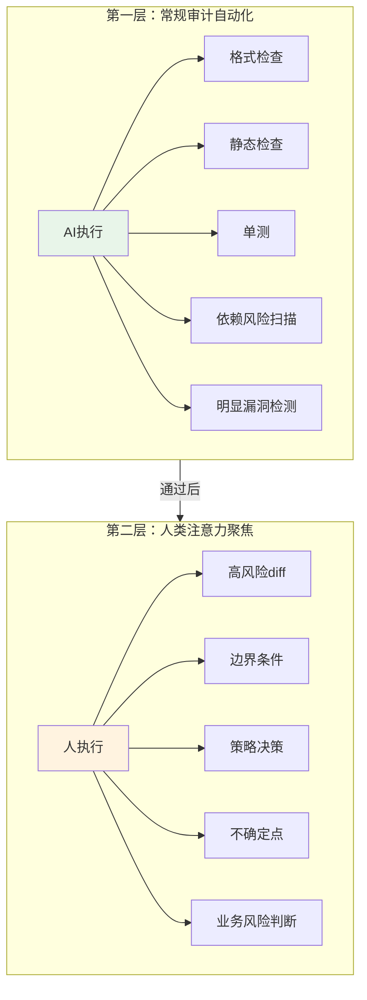
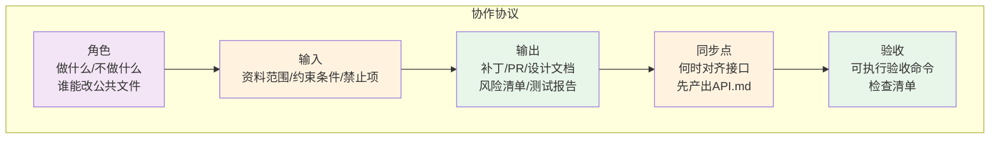

# Agentic Coding 知识结构流程图

> 本流程图与 README.md 内容结构对应，同时包含原文的工程视角结构图。

---

## 一、心智模型：核心概念网络（对应README 1.1）

---

## 二、深度测试：理解层级边界（对应README 1.3）

---

## 三、对抗测试：脆弱点与反事实（对应README 3.1-3.2）

---

## 四、反事实情境（对应README 3.2）

---

## 五、工程视角：八大趋势（对应README 四）

---

## 六、工程视角：四个优先级（对应README 四）

---

## 七、工程视角：举手阈值规则（对应README 五.1）

---

## 八、工程视角：监督两层拆分（对应README 五.2）

---

## 九、工程视角：协作协议五要素（对应README 五.3）

