# Claude Skills 知识结构流程图

> 本流程图与 README.md 内容结构对应，同时包含工程视角的结构图。

---

## 一、心智模型：核心概念网络（对应README 1.1）

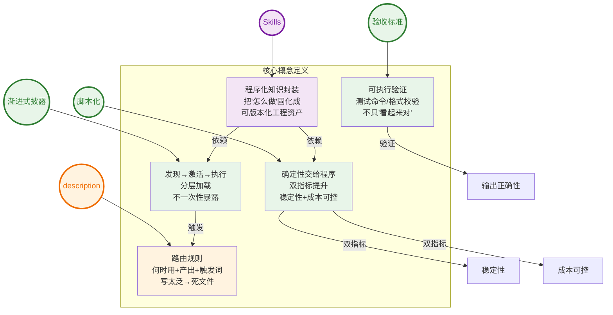

---

## 二、专家视角：共识与分歧（对应README 1.2）

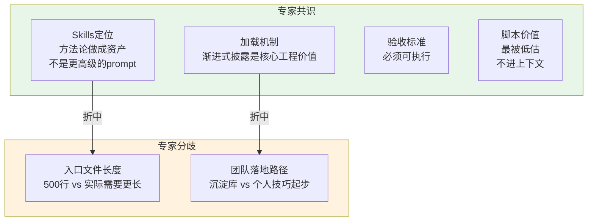

---

## 三、深度测试：理解层级边界（对应README 1.3）

```mermaid
flowchart TD
    %% 问题标题放大显示
    TITLE1["# Q1: 为什么 Skills 不是更高级的提示词？"]
    TITLE2["# Q2: description 写太泛会发生什么？"]
    TITLE3["# Q3: 为什么脚本化是最被低估的部分？"]
    
    TITLE1 --> Q1
    
    subgraph Q1["理解层级"]
        L0_1["L0: 放在文件里"]
        L1_1["L1: 分层加载"]
        L2_1["L2: 脚本能力 + 工程资产<br/>把确定性交给程序<br/>形成可版本化可验收资产"]
    end
    
    TITLE2 --> Q2
    
    subgraph Q2["理解层级"]
        L0_2["L0: 不知道什么时候用"]
        L1_2["L1: 触发率低"]
        L2_2["L2: 路由失效→死文件<br/>必须写清何时用+产出+触发词"]
    end
    
    TITLE3 --> Q3
    
    subgraph Q3["理解层级"]
        L0_3["L0: 执行命令"]
        L1_3["L1: 减少工作量"]
        L2_3["L2: 双指标提升<br/>脚本不进上下文<br/>稳定性+成本可控"]
    end
    
    L0_1 -->|"问为什么"| L1_1 -->|"提炼原则"| L2_1
    L0_2 -->|"问为什么"| L1_2 -->|"提炼原则"| L2_2
    L0_3 -->|"问为什么"| L1_3 -->|"提炼原则"| L2_3
    
    style TITLE1 fill:#f3e5f5,stroke:#333,stroke-width:3px
    style TITLE2 fill:#f3e5f5,stroke:#333,stroke-width:3px
    style TITLE3 fill:#f3e5f5,stroke:#333,stroke-width:3px
    style L0_1 fill:#ffebee
    style L0_2 fill:#ffebee
    style L0_3 fill:#ffebee
    style L2_1 fill:#e8f5e9
    style L2_2 fill:#e8f5e9
    style L2_3 fill:#e8f5e9
```

---

## 四、对抗测试：脆弱点与反事实（对应README 3.1-3.2）

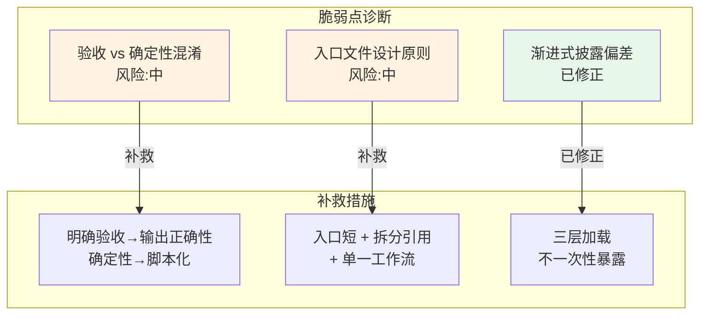

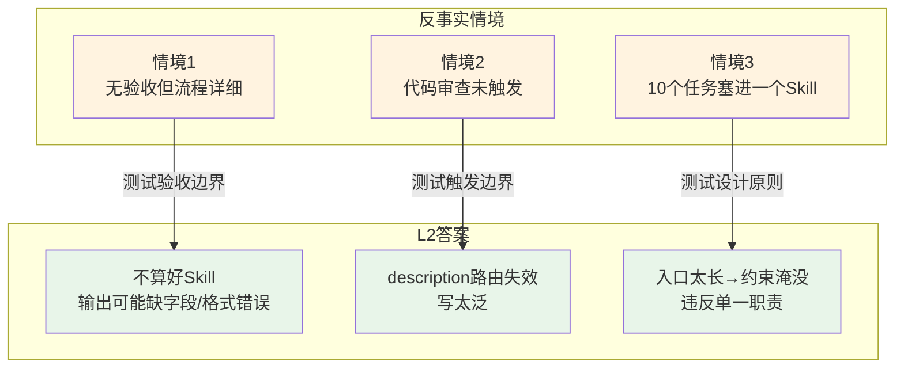

---

## 五、验证体系（对应README 四）

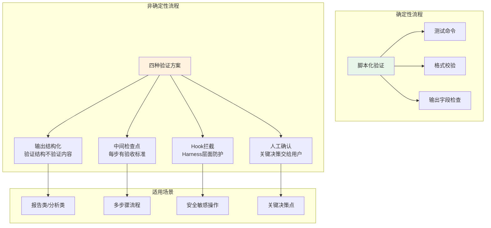

---

## 六、工程结构：Skills核心结构（工程视角）

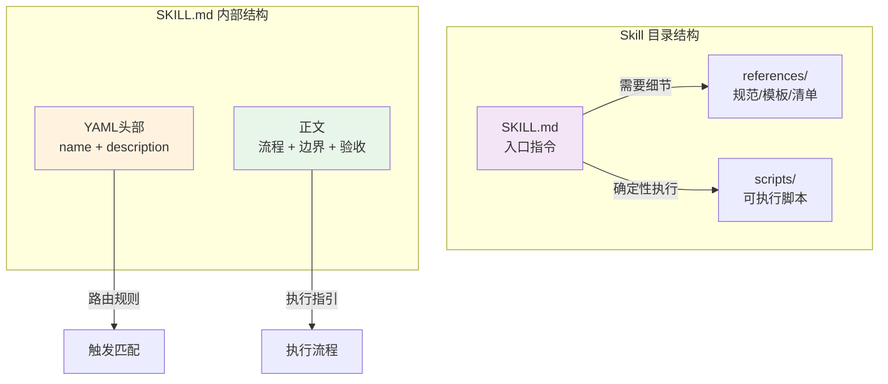

---

## 七、工程结构：渐进式披露机制（工程视角）

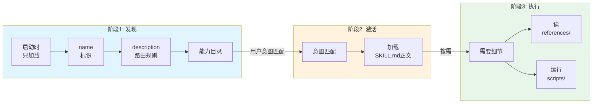

---

## 八、工程结构：三问题三方案（工程视角）

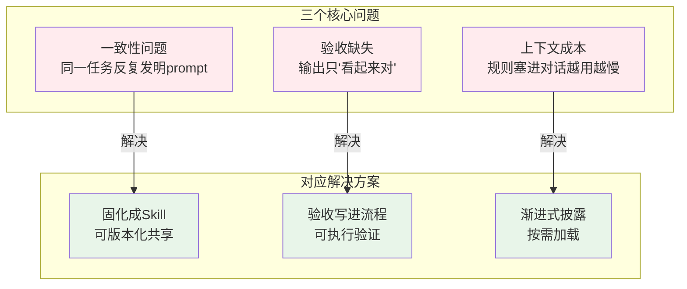

---

## 九、生命周期管理：四步闭环（对应README 七）

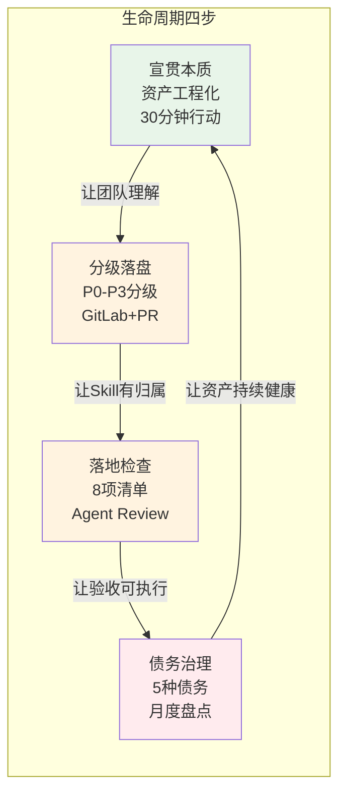

---

## 十、生命周期管理：分级标准（对应README 七.2）

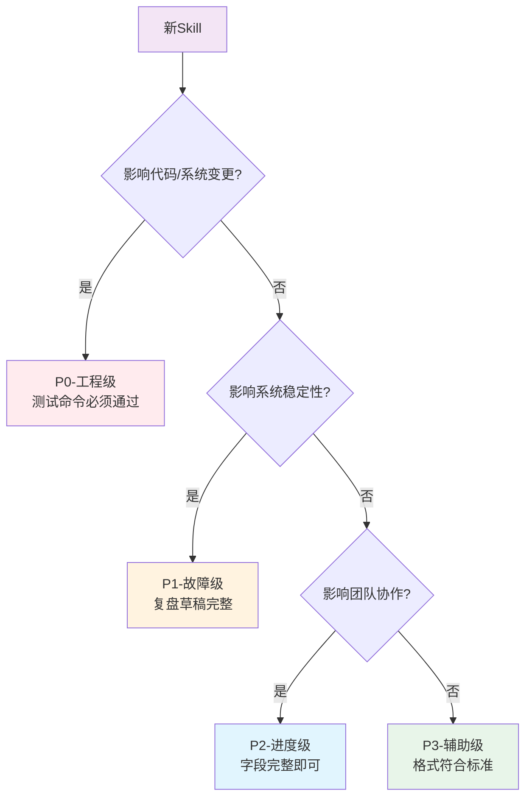

---

## 十一、生命周期管理：命中率等级（对应README 七.3）

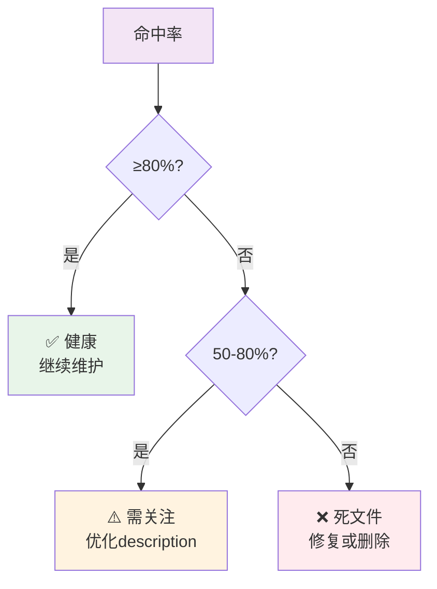

---

## 十二、生命周期管理：债务类型（对应README 七.4）

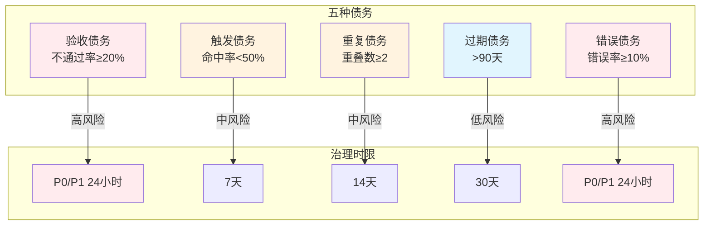