# Claude Skills 概念思维导图

> 本思维导图与 README.md 内容结构对应，同时包含工程视角的结构。

---

## 一、心智模型：核心概念网络（对应README 1.1）

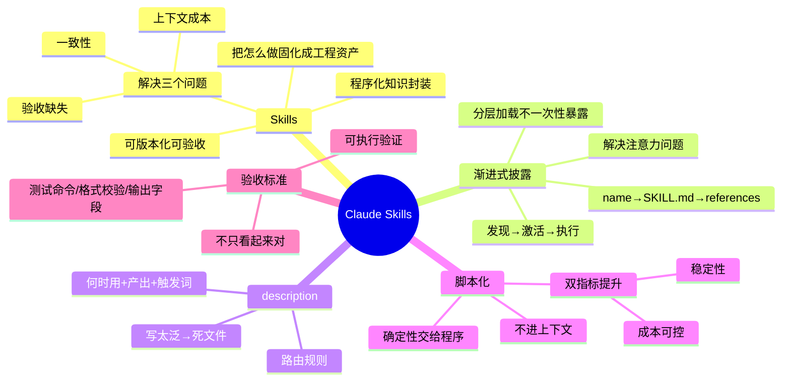

---

## 二、专家视角（对应README 1.2）

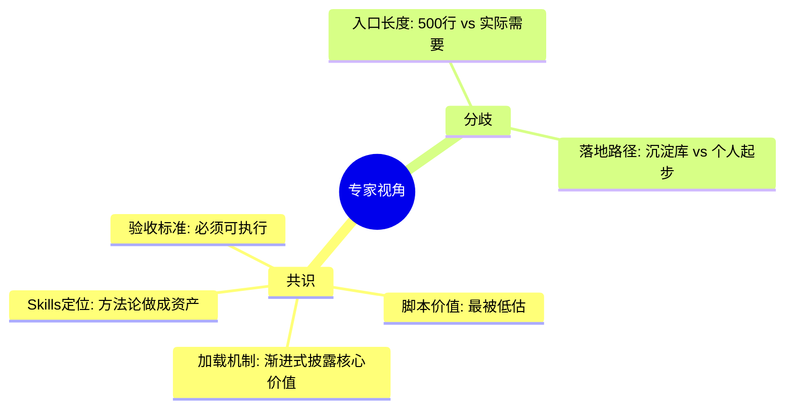

---

## 三、深度测试问题（对应README 1.3）

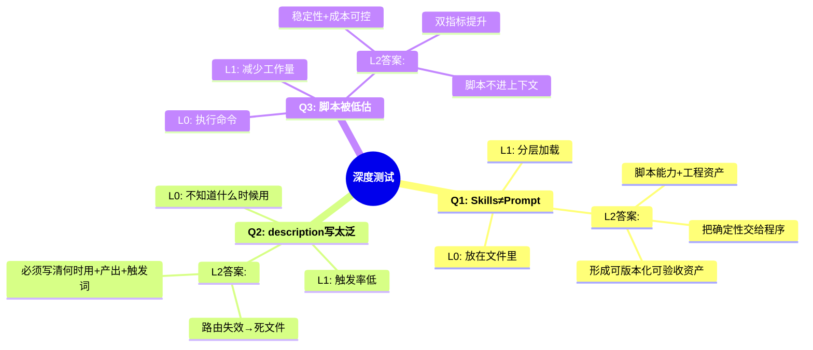

---

## 四、对抗测试（对应README 3.1-3.2）

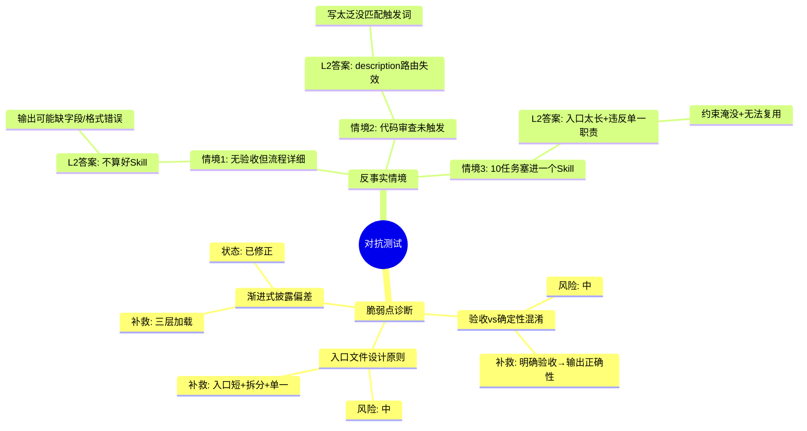

---

## 五、验证体系（对应README 四）

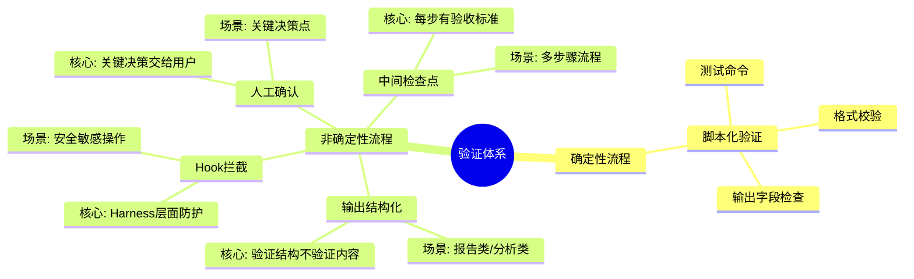

---

## 六、工程结构：Skills目录与SKILL.md（工程视角）

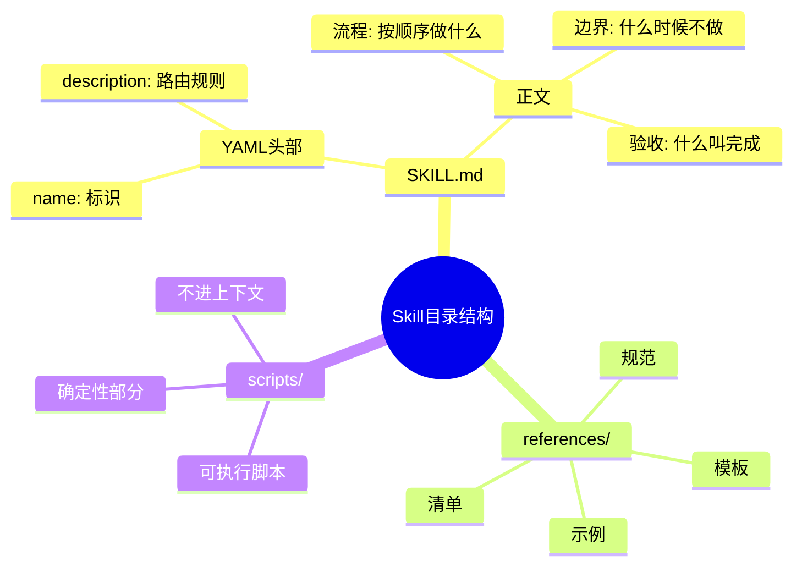

---

## 七、工程结构：渐进式披露三阶段（工程视角）

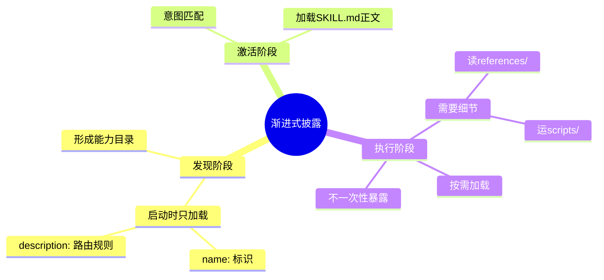

---

## 八、工程结构：三问题三方案（工程视角）

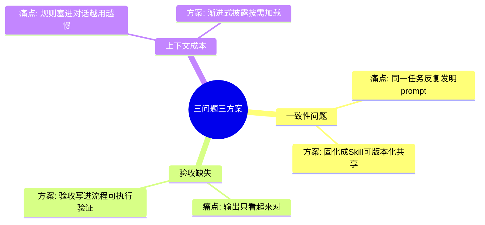

---

## 九、生命周期管理：四步闭环（对应README 七）

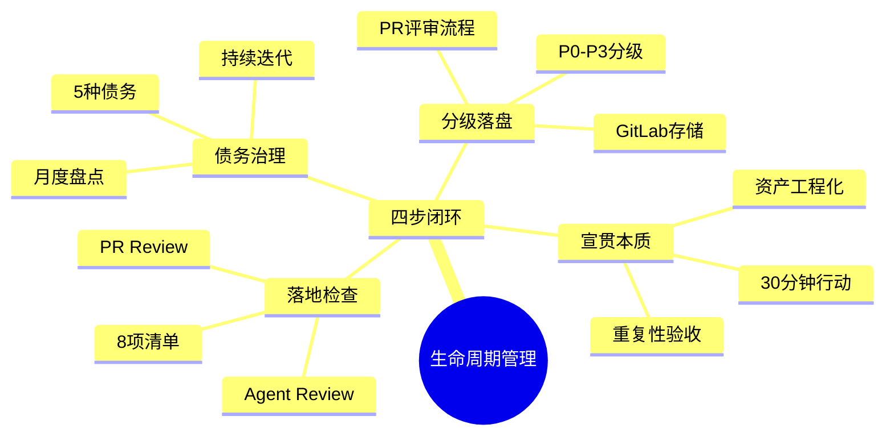

---

## 十、生命周期管理：分级标准（对应README 七.2）

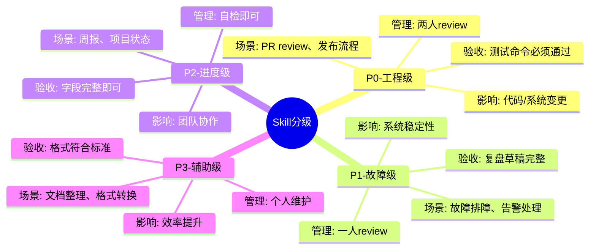

---

## 十一、生命周期管理：命中率量化（对应README 七.3）

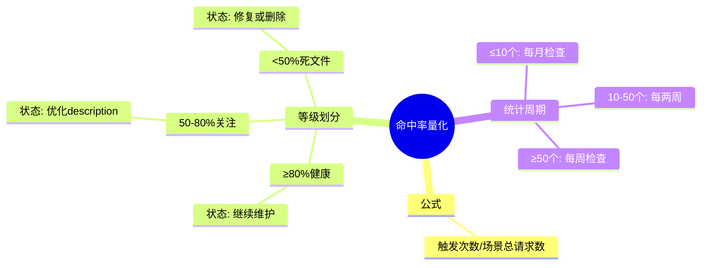

---

## 十二、生命周期管理：债务类型（对应README 七.4）

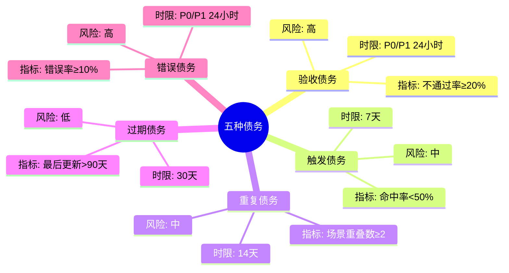